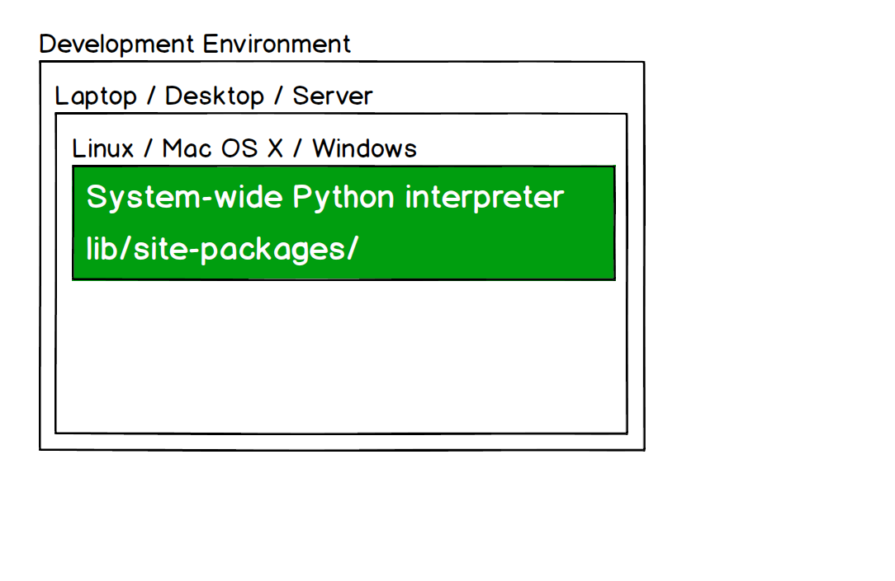
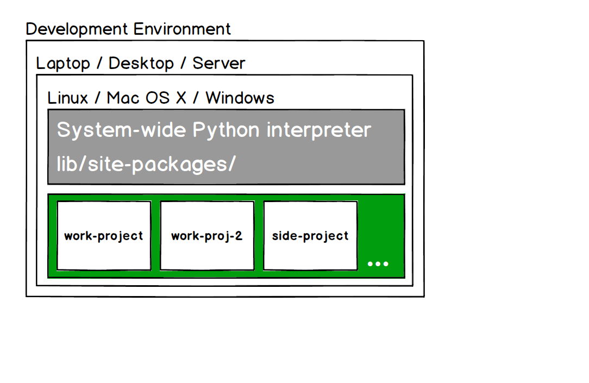

# Presentation Walkthrough

## Part 1: Demo the dependencies problem
1. Bring up terminal.

1. First we need to know what Python interpreter are we using?

        $ which python

1. We will see output like the following.

        /usr/local/bin/python

1. Lets check out what is in that folder.

        cd /usr/local/bin
        ls

1. Our Python packages are stored in a slightly different directory though.

        cd /usr/local/lib/site-packages/

1. We are working on Django 1.6 for our day job. We still have not had time
   to upgrade to the latest release with all the new functionality that is
   being built. South is being used with the project to handle schema 
   migrations:

        sudo pip install django==1.6 South

1. In our side project we want to use Django 1.8, which includes schema
   migrations so South is no longer necessary.

        sudo pip install django==1.8

1. But we are stuck because we already have Django 1.6 installed in our
   system Python lib folder.

   

1. What now?

    * Do we ``pip install --upgrade django``? 
    * What about when we need to do some coding on a different work project? 
    * What if we do not have fast Internet access to quickly switch versions?
    * What happens when we have like 20 different libraries that need different
      versions installed?

This situation is the problem virtualenv was created to solve.

## Part 2: What is virtualenv?
1. Virtualenv isolates library dependencies by duplicating Python installations
   with their own, clean site-packages folder.

1. So with our example problem, we only had a single Python interpreter.
   
   

1. Virtualenv allows us to have many independent Python interpreters with 
   their own isolated dependencies.

   
    

## Part 3: Demo the solution

## Part 4: Virtualenvwrapper and extensions

## Conclude & more resources
* [Application dependencies page](http://www.fullstackpython.com/application-dependencies.html)

